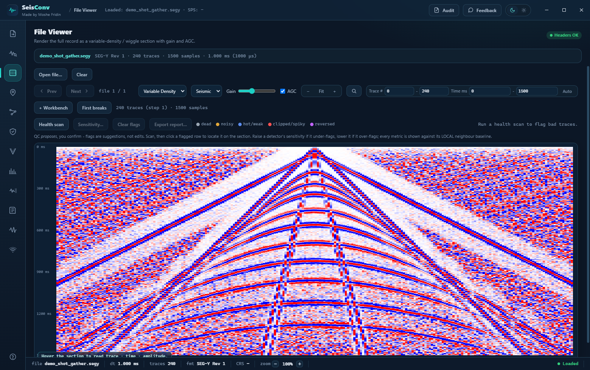
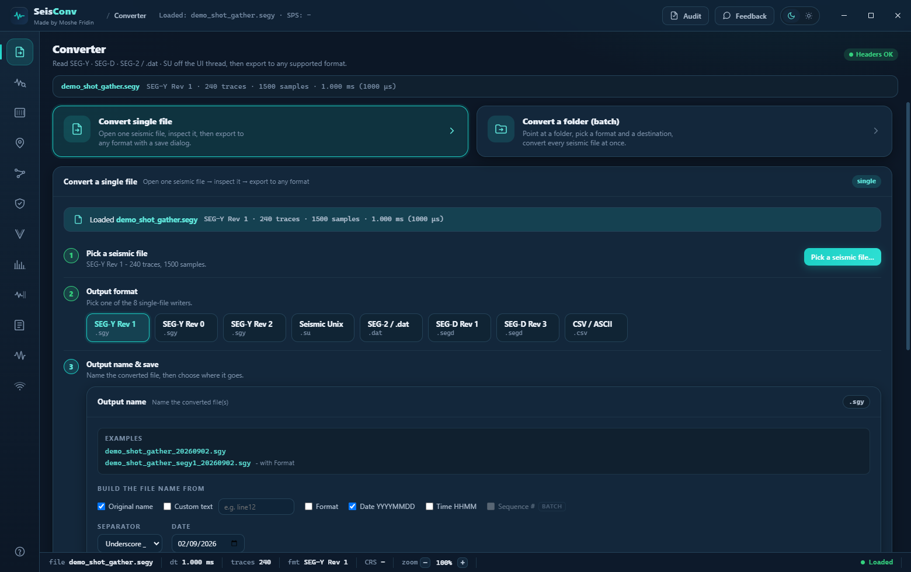
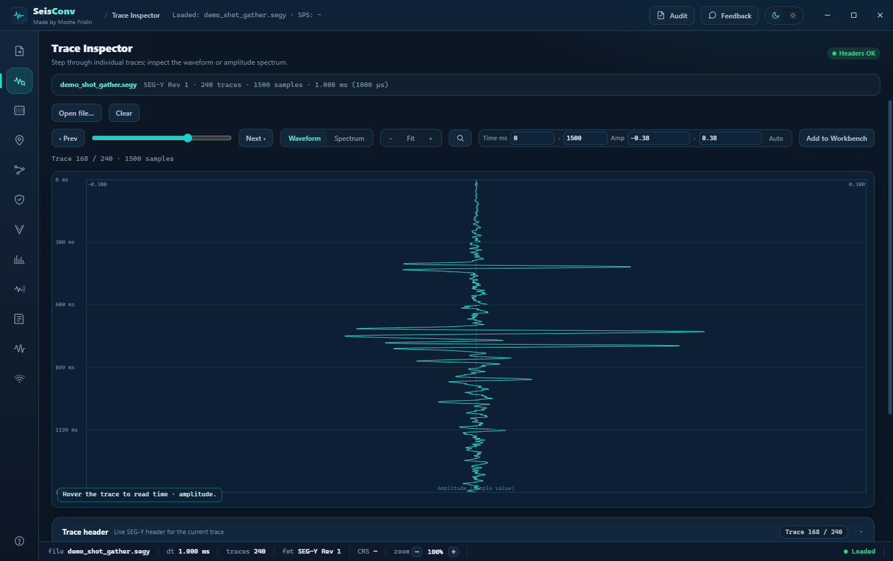
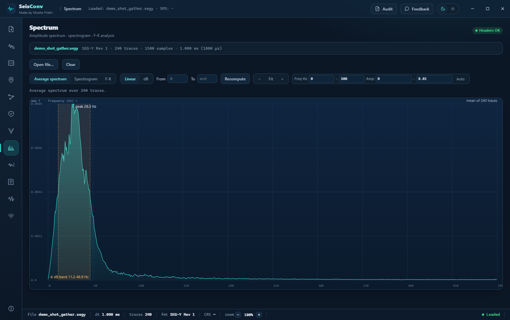
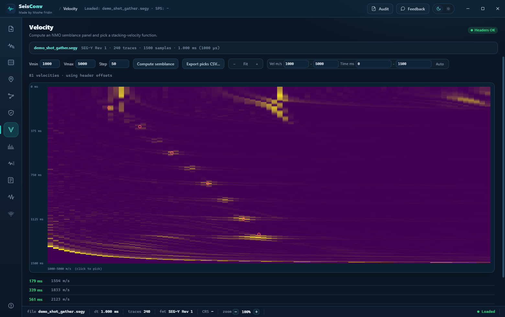
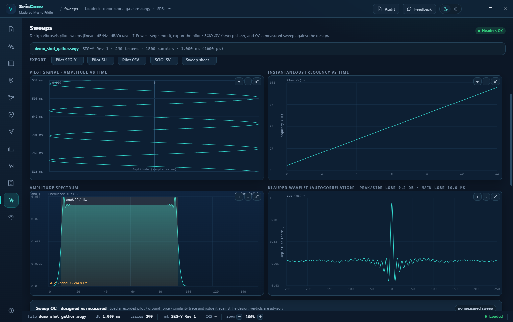
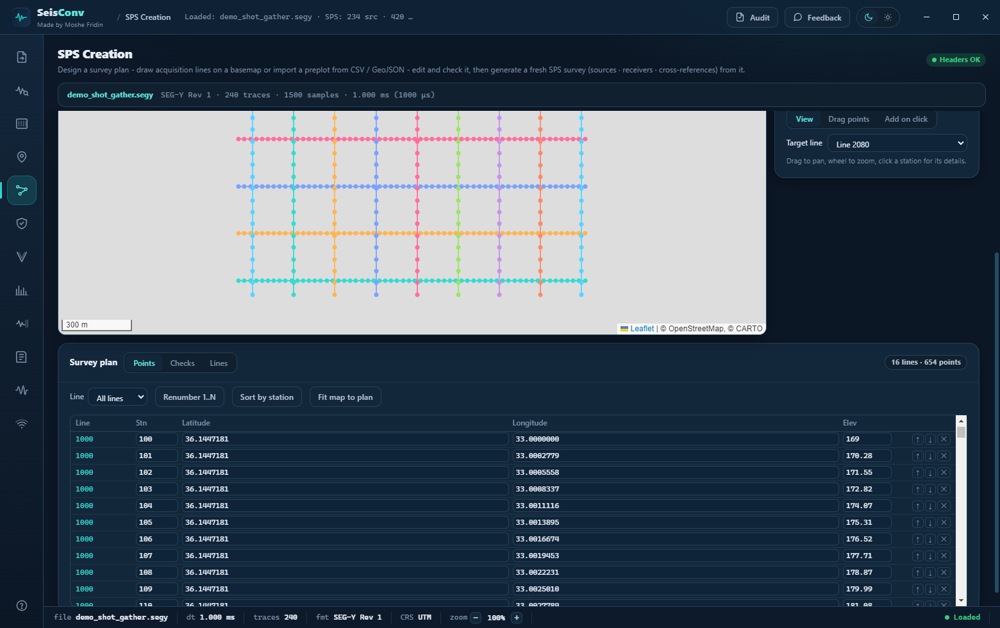
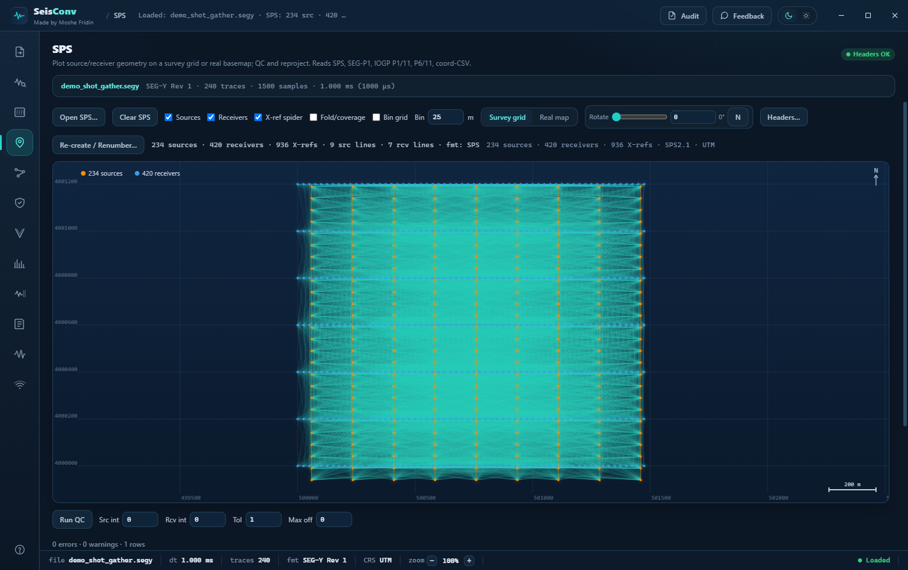
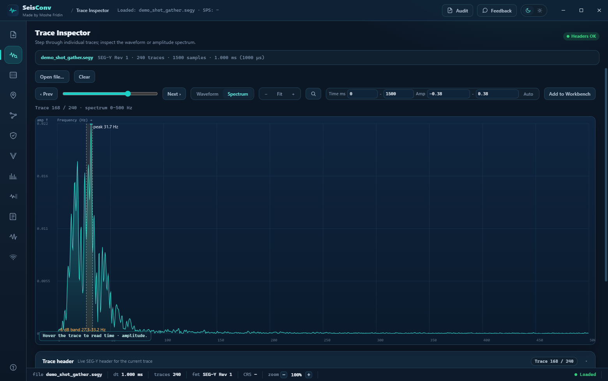

<p align="center">
  
</p>

<h1 align="center">SeisConv</h1>
<p align="center">
  A free, open source <b>SEG-Y viewer and converter</b> for Windows - with SEG-D, SEG-2 and Seismic Unix<br/>
  support and <b>SPS survey geometry QC</b>. Automatic format and byte-order detection; nothing to configure to open a file.
</p>

<p align="center">
  
  
  
  
  
  
  
  
  
  
</p>

<details>
<summary><b>Contents</b></summary>

- [Download](#download)
- [What it does](#what-it-does)
- [Format support](#format-support)
- [Features](#features)
  - [Converter](#converter)
  - [Trace Inspector](#trace-inspector)
  - [File Viewer](#file-viewer)
  - [SPS](#sps)
  - [SPS Creation](#sps-creation)
  - [Geometry QC](#geometry-qc)
  - [Sweeps](#sweeps)
  - [Velocity](#velocity)
  - [Trace Workbench](#trace-workbench)
  - [Observer's Log](#observers-log)
  - [WiFiSync](#wifisync)
  - [Spectrum Analysis](#spectrum-analysis)
  - [Viewer controls](#viewer-controls)
- [Architecture](#architecture)
- [Build and run](#build-and-run)
- [Installer](#installer)
- [SEG standards note](#seg-standards-note)
- [Coordinate reference systems and attribution](#coordinate-reference-systems-and-attribution)
- [Roadmap](#roadmap)
- [License](#license)

</details>

SeisConv is a free, **open source** (**AGPL v3**) desktop **SEG-Y viewer and converter** and **SEG-D converter** for Windows, which also reads and writes SEG-2 and Seismic Unix and does **SPS survey geometry QC** on the same data. It **runs offline** - no account, no cloud, no licence server - and nothing you open is uploaded anywhere. The only feature that touches the internet is the optional real-map basemap on the SPS tabs, which fetches map tiles; everything else, the ~7,000-CRS EPSG registry included, works with no connection at all.

**Who it is for:** field crews, party chiefs and observers who need to check and convert a record on the spot, and processing geophysicists who need geometry and headers to be right before the data reaches a processing system.

> **Why SeisConv?** One desktop app that takes a raw field record from the recorder to QC'd, geometry-stamped, processing-ready data - auto-detecting format, revision, encoding, and byte order so you never hand-configure a reader. Office and field, SEG-D to SPS, in one tool.

---

## Download

**Windows 10 / 11, 64-bit.** Download `SeisConv-Setup-0.7.10.exe` from the
[latest release](https://github.com/m0shiko8811-beep/SeisConv/releases/latest)
and run it. The installer lets you choose the installation directory (per-user
by default, with an option to elevate and install for all users).

> **The installer is not code-signed.** On first run Windows SmartScreen will
> show *"Windows protected your PC"*. Click **More info**, then **Run anyway**.
> This is expected for an unsigned installer and is not an indication that
> anything is wrong with the download.

macOS (DMG) and Linux (AppImage) targets are defined in the build configuration
but are **not built or distributed** - on those platforms, build from source
(see [Build and run](#build-and-run)).

---

## What it does

SeisConv is a Windows desktop application built on Electron, with a platform-agnostic TypeScript core, for working with seismic data files. Drop in any file and SeisConv identifies the format revision, sample encoding (IBM float vs IEEE), and byte order automatically - before you choose an output format. All parsing runs on a worker thread; the UI stays responsive on multi-gigabyte files.

Twelve tabs cover the full office-and-field workflow: format conversion incl. batch → single tape-image combine (Converter), per-trace inspection with FFT QC (Trace Inspector), section visualization with first-break picking and trace-health QC (File Viewer), multi-format survey-geometry QC (SPS), survey design from a map (SPS Creation), NMO velocity analysis (Velocity), frequency/wavenumber analysis (Spectrum Analysis), multi-trace comparison and correlation (Trace Workbench), configurable field-log grid (Observer's Log), SEG-Y↔SPS cross-validation (Geometry QC), a vibroseis sweep designer + sweep QC (Sweeps), and built-in peer-to-peer file/data sharing over local WiFi with no router or configuration (WiFiSync). Multi-gigabyte files open through a streaming trace index, and any operation that can take more than a few seconds shows a progress bar.

If you are looking for an **open source alternative** to a commercial format converter or SEG-Y viewer, SeisConv is meant to complement rather than replace the established toolchain: it **complements Seismic Unix, OpendTect and ObsPy** for the specific jobs of format conversion, header and geometry QC, and survey positioning, and it puts those jobs in a graphical Windows application that needs no scripting environment to run.

<p align="center">
  
</p>
<p align="center"><sub>File Viewer - full-record seismic section with colormap, gain and AGC controls</sub></p>

<table align="center">
  <tr>
    <td align="center" width="50%"><br/><sub><b>Converter</b> - auto-detect + 8 single-file output writers</sub></td>
    <td align="center" width="50%"><br/><sub><b>Trace Inspector</b> - waveform + live SEG-Y trace header</sub></td>
  </tr>
  <tr>
    <td align="center" width="50%"><br/><sub><b>Spectrum Analysis</b> - amplitude spectrum / FFT QC</sub></td>
    <td align="center" width="50%"><br/><sub><b>Velocity</b> - NMO semblance panel</sub></td>
  </tr>
  <tr>
    <td align="center" width="50%"><br/><sub><b>Sweeps</b> - vibroseis sweep designer and its live plots</sub></td>
    <td align="center" width="50%"><br/><sub><b>SPS Creation</b> - survey design on a map, with the plan table</sub></td>
  </tr>
</table>

<p align="center">
  
</p>
<p align="center"><sub>SPS - multi-format survey geometry &amp; QC (synthetic demo survey shown; real coordinates not pictured)</sub></p>

---

## Format support

| Format | Read | Write | Notes |
|---|:---:|:---:|---|
| SEG-Y Rev 0 | Yes | Yes | IBM float + IEEE float; EBCDIC / ASCII text header |
| SEG-Y Rev 1 | Yes | Yes | Extended text headers |
| SEG-Y Rev 2 | Yes | Yes | Rev 2.0 / 2.1; all rev-2 sample-format codes |
| SEG-D Rev 2.1 | Yes | Yes | Spec-conformant reader (GH1/GH2, channel sets, trace-header extensions) - validated **bit-identical** against paired vendor SEG-Y on real recorder field data |
| SEG-D Rev 3.0 | Yes | Yes | Same validation; legacy SeisConv-written SEG-D still reads via a compatibility decoder |
| SEG-2 / Geode `.dat` | Yes | Yes | |
| Seismic Unix (SU) | Yes | Yes | |
| Tape Image `.tpimage` | Yes | Yes | Single-file tape images and **batch → one combined multi-record tape** (streamed, memory-bounded); multi-GB tapes open via a streaming trace index. Unsupported vendor SEG-D tape containers fail fast with an honest message |
| CSV | - | Yes | Export / analysis |

### Survey geometry / positioning formats

| Format | Read | Write | Notes |
|---|:---:|:---:|---|
| SPS 2.1 (S / R / X) | Yes | Yes | The native survey-geometry format and SeisConv's internal data model. A survey is the three files together: sources (`.s`), receivers (`.r`) and the cross-reference relation (`.x`) that ties each shot to the channels it was recorded on. Read as a triplet, written as a triplet, and the only export that also ships a matching `.prj` because it is already delivered as a zip. Generated surveys and re-numbered surveys are written in this format. |
| SEG-P1 | Yes | Yes | Deprecated by IOGP (succeeded by P1/11), but still demanded by some legacy processing packages, so a writer is provided (grid easting/northing in decimetres). Fixed-column post-plot point file. Geographic records auto-projected lat/long → E/N; F-format metres vs integer-decimetres auto-detected. |
| IOGP P1/11 | Yes | Yes | Modern comma-delimited relational positioning standard (supersedes UKOOA P1/90 and SEG-P1; v1.1 added land/OBC). Source, receiver, and relation records map onto SeisConv's SPS data model; CRS round-trips. |
| IOGP P6/11 | Yes | - | Bin-grid definition (origin, rotation, inline/crossline numbering, bin size, CRS). Rendered as a bin-grid overlay on the SPS survey-grid and Leaflet map; rotation and crossline-axis aware. No writer yet. |
| Coordinate CSV (CRS-tagged) | Yes | Yes | Generic point CSV with an explicit CRS tag (ITM / UTM / WGS84) and flexible column-synonym mapping (line, point, type, easting/x, northing/y, elevation/z). |

**Automatic detection:** format revision, sample format (IBM 4-byte float, IEEE float, 2-byte int, etc.), and byte order (big/little-endian) are detected from the file header before conversion. No manual override required for well-formed files.

**Two conversion modes:** convert a **single file** (with a native save dialog), or point at a **folder** and batch-convert every seismic file in it - with a format/destination wizard, a live per-file progress bar, and a Cancel button.

---

## Features

### Converter

Two modes selected from the top of the tab.

**Single file:** open a file (`Ctrl+O` or drag-and-drop), review the auto-detected **File summary** (traces, samples per trace, sample interval, record length, data format, revision, byte order, CRS) and **Header QC** flags. Pick an output format chip from the **eight single-file writers** (SEG-Y Rev 0/1/2, Seismic Unix, SEG-2 / `.dat`, SEG-D Rev 1, SEG-D Rev 3, CSV), then **Convert & Save...** via a native save dialog. Tape Image is not a single-file chip - it is the batch-combine target, offered in folder mode only.

**Folder (batch):** pick a source folder - SeisConv lists every recognized seismic file. A short wizard asks for the output format and a destination folder, then runs the batch. A **live progress bar** tracks `Converting X / N · <filename> · FORMAT`. A per-file result list marks each file QUEUED → CONVERTING → DONE / ERROR. **Cancel** stops after the current file; completed files are kept. Choosing **Tape Image** combines the whole batch into **one multi-record tape** - written to disk file-by-file (memory-bounded), so multi-GB tapes work.

Output names are assembled from a **checklist of variable parts** ({name}, {format}, {date}, {time}, {seq}, custom text) with live examples. An **Open folder** button at the end of both wizards jumps to the results. Additional controls: **Clear** (reset state and worker cache), in-app **Manual** (Help / `?`), **Send Feedback** (opens your mail app), light/dark theme toggle, OS-aware keyboard shortcuts.

---

### Trace Inspector

Per-trace canvas wiggle with prev/next navigation buttons and a slider. Includes a **Hann-windowed FFT amplitude spectrum** panel - toggle between waveform and spectrum view for per-trace frequency QC.

<p align="center">
  
</p>
<p align="center"><sub>Trace Inspector - wiggle + FFT amplitude spectrum (Hann window)</sub></p>

---

### File Viewer

Full seismic section rendered in four display modes:

- Variable-density (heatmap)
- Wiggle trace
- Variable-area (filled wiggle)
- VD + wiggle overlay

Four colormaps: Seismic (blue-white-red), Gray, Amber, Viridis. Adjustable gain slider and automatic AGC. Section pan and zoom, a **magnifier box-zoom** popup with its own wheel-zoom / ± / reset / drag-pan, hover readout (trace, time, amplitude, FFID/CDP), Next/Prev file navigation, and **block paging** through multi-gigabyte files (streamed trace index - a 1.7 GB tape opens in seconds and pages smoothly).

**First Breaks mode** - a seeded, moveout-guided first-break picker on the same section: drop a few seed picks, hit *Assisted fill*, and the pick line follows the refraction moveout inside a guide window (no scatter into deep reflections); drag to edit, export picks as CSV.

**Trace-health QC** - scans the gather with robust local-median statistics and flags dead, noisy, hot/weak, clipped/spiky, and reversed-polarity traces, each with the metric-vs-local-baseline evidence, a confidence score, a coverage banner, tunable per-detector sensitivity with live re-count, and a sortable/filterable findings table that locates each flagged trace on the section.

---

### SPS

The SPS tab accepts SPS 2.1 S/R/X triplets and four additional positioning formats via the same Open dialog (`.p1`, `.segp1`, `.p111`, `.p611`, `.csv`): **SEG-P1** (read + write - deprecated fixed-column post-plot file, written for legacy processing packages), **IOGP P1/11** (read + write - the current relational standard), **IOGP P6/11** (read only - bin-grid definition), and **CRS-tagged coordinate CSV** (read + write). All formats feed the same SPS data model, so the survey-grid, map, QC checks, fold map, and coordinate-reprojection features work identically regardless of which format was loaded. A format badge in the tab header indicates what is currently loaded.

<details>
<summary>Header viewer/editor, bin-grid overlay, exports, geometry views, QC checks, and coordinate reprojection</summary>

**Header Viewer / Editor:** a modal over the SPS panel lets you view the full H-record block grouped by purpose (Project/Admin, CRS/Projection, and others), edit CRS and Admin fields via structured forms, and edit every raw H-record in a Raw tab. Changes can be applied and exported as a corrected ZIP containing the updated S/R/X files.

**Bin-grid overlay:** when an IOGP P6/11 file is loaded, the survey-grid canvas and the Leaflet real map display a bin-grid overlay (origin, rotation, and crossline-axis aware) on top of the station positions.

**Exports** (toolbar buttons):
- KML (Google Earth geometry overlay)
- GeoJSON (GIS-ready)
- CSV (sources, receivers, or relations)
- IOGP P1/11
- CRS-tagged coordinate CSV
- SPS 2.1 and SEG-P1
- **ESRI Shapefile** - zipped source and receiver point layers (`.shp` / `.shx` / `.dbf` / `.prj` / `.cpg`), PointZ geometry so station elevation survives
- **GeoTIFF** - georeferenced raster export of the CMP fold map, an inverse-distance-weighted elevation surface, and the survey layout, all on one shared grid, with an optional resampled basemap
- Full QC report
- ESRI Shapefile point layers (`.shp` / `.shx` / `.dbf` / `.prj` / `.cpg`, zipped) and georeferenced GeoTIFF rasters - both open straight into **QGIS**, **ArcGIS** or **Global Mapper** already positioned

**Any-to-any positioning export** (the *Export as* dropdown): whatever was loaded can be written back out as **SPS 2.1**, **SEG-P1**, **IOGP P1/11** or **coordinate CSV**. The **SPS 2.1** export - and only it - carries a matching ESRI **`.prj`** (WKT) beside the S/R/X files, because that export is already delivered as a zip, so the survey drops onto a **QGIS**, **ArcGIS** or **Global Mapper** map already georeferenced. The other three are single files and stay single files: a `.prj` beside them would silently turn "save a .csv" into "save a .zip", so they state their CRS inside the file instead - a `# CRS:` tag in coordinate CSV, an `H,CRS` record in IOGP P1/11, and an `H GRID: … DATUM …` header line in SEG-P1. A survey whose CRS cannot be described honestly in WKT is given **no** `.prj` rather than a guessed one; an absent `.prj` reads as "CRS unknown" to every GIS.

The SPS 2.1 export ships a matching `.prj` (ESRI WKT) alongside the triplet, so the exported points land already georeferenced in QGIS, ArcGIS or Global Mapper. A survey whose CRS is unknown, or whose projection cannot be described honestly in WKT, gets no `.prj` rather than a guessed one, because an absent `.prj` reads as "CRS unknown" to every GIS while a plausible wrong one does not. The other three exports are a single file each and state their CRS inside that file instead, so saving a `.csv` still gives you a `.csv` rather than a zip: coordinate CSV carries a `# CRS:` tag, IOGP P1/11 an `H,CRS` record, and SEG-P1 an `H GRID:` header naming the projection and datum.

Load an SPS 2.1 survey (S-file, R-file, X-file). Two geometry views:

- **Survey grid** - offline pan/zoom canvas showing source (S) and receiver (R) stations, color-coded by type
- **Real map** - live Leaflet basemap (Dark / Satellite / Streets tile layers) with stations plotted at their geographic coordinates. A bearing slider (with reset-to-North button) rotates the map via the leaflet-rotate plugin.

**Station Inspector:** click any source or receiver to open a panel showing the full parsed SPS header for that station.

**X-ref spider:** select a station to draw offset lines to every related station in the X-file - shows the actual coverage geometry for that point.

**CMP fold/coverage map:** plots every CMP mid-point bin and colors it by fold count, giving a quick visual QC of coverage uniformity across the survey.

**SPS QC** checks flag:
- Duplicate source / receiver IDs
- Station numbering gaps
- Irregular station intervals
- Missing X-file references
- Elevation outliers
- Offset range violations

**Coordinate reprojection:** transform any SPS dataset to a target EPSG (UTM zones, ITM, BNG, RD New, ED50, and others). Output is a ZIP with reprojected S/R/X files ready for import into processing software.

</details>

---

### SPS Creation

Design a survey plan, edit it, check it, then generate a complete SPS 2.1 triplet (with H00 + full header block) - auto-loaded into the SPS tab and exportable as a ZIP.

**Two ways in.** Pick line vertices on a live map (with live coordinates and distance-from-last-point readouts), or **import an existing pre-plot** from CSV, TSV or GeoJSON through a column-mapping wizard: it sniffs the delimiter, detects a header row, guesses which column is the line, the station, the coordinates and the elevation, and lets you correct any of it against a live preview. Rejected rows are named with their line number rather than dropped silently.

**Lat/long or projected E/N, decided by the values, not the column names** - so a mis-labelled header cannot silently misplace a survey. A `# CRS:` tag in the file selects the CRS by itself; projected data with no tag has to be given one before Import will run.

**Imported stations are used exactly as given.** A pre-plot keeps its own numbers and its own positions - nothing is re-sampled, and coordinates already in the target CRS are written through untouched. Hand-drawn lines are vertices instead, with stations laid along them at the acquisition interval. Every line shows which of the two it is.

**Editing:** drag a station on the map; edit line, station, latitude, longitude and elevation in a virtualized table; reorder and delete points; renumber a line 1..N; sort by station; fit the map to the plan. 50-step undo covers all of it, and the plan survives a restart.

**On the map:** direction arrows per segment, the distance on each segment, numbered station markers, and an independent visibility toggle + opacity slider for the basemap, the connection lines, the arrows, the labels and the stations. Click a station for its line, number, lat/long, projected E/N, elevation, distance from the line start, distance from the previous station and azimuth.

**Plan checks before generation** - duplicate station numbers within a line, duplicate line names, irregular intervals against the line's own median, coincident stations, non-monotonic numbering, missing numbers on a pre-plot, gross positional outliers, implausible elevations. Errors block Generate and say what to fix. A station number repeated on two different lines is information, not an error, because SPS numbering is per line.

**Export the plan itself** as CSV, GeoJSON or KML before it becomes a survey; the CSV carries per-segment distance and azimuth and re-imports through both this wizard and the SPS tab.

Then choose 2D or 3D layout parameters in the wizard (line/station numbering, intervals, receiver patch) and pick the CRS from a searchable EPSG list.

---

### Geometry QC

Cross-validates a SEG-Y file against the loaded SPS survey: source/receiver coverage, coordinate agreement (scalar-aware), stack-type detection (pre-stack vs CMP-stacked), and an as-laid vs pre-plot **delta check** with an offenders table. Can also **load geometry into SEG-Y** - stamp SPS coordinates, elevations, offsets, and scalars into the trace headers and save a corrected copy.

---

### Sweeps

A vibroseis sweep **designer and QC** tool (built around Pelton/SSC Vib Pro-class vibrator electronics):

- **Builder** - linear, dB/Hz, dB/Oct, and T-Power sweep laws, up to 16 phase-continuous segments, cosine/Blackman tapers, initial phase, pilot sample interval (0.25-2 ms), per-survey **presets** (save/load/share as JSON).
- **Live plots** - pilot signal, frequency-vs-time, amplitude spectrum, and the autocorrelation **Klauder wavelet** with peak-to-side-lobe metrics.
- **Exports** - pilot trace (SEG-Y Rev 2 / SU / CSV), a **SCIO `.SV` sweep-definition file** (loads into the vibrator toolchain), and a printable **sweep sheet** with embedded plots.
- **Sweep QC** - load a recorded sweep (pilot/ground-force/similarity) and compare against the design: phase-error vs time, THD vs time, envelope and spectrum overlays, designed×measured correlation wavelet, with tunable pass/fail thresholds stored in the preset.

---

### Velocity

NMO semblance panel computed from CMP gathers in the loaded file. Click the semblance display to pick velocity-time pairs. Export the picked velocity function as a CSV for use in processing software.

---

### Trace Workbench

Collect traces from one file or many and view them side-by-side or overlaid on a shared time axis with synchronized zoom. Per-trace operations include cross-correlation and difference; a stats panel shows per-trace and aggregate amplitude statistics. Click-to-add works directly from the File Viewer section display and the Trace Inspector. The collected set can be exported as a seismic file (all supported output formats).

Manual X (time) and Y (amplitude) axis range boxes - with an Auto reset - control the shared display window.

---

### Observer's Log

A configurable field-log grid for recording shot-by-shot or point-by-point acquisition metadata. Column behavior is driven by a ROLE system: counter (auto-increment), Now/NTP time stamping, status dropdown (pick list), and SPS-linked cells that pull a named field (line, point, easting, northing, elevation, uphole, static, source type) from the loaded SPS survey with live per-row lookup. A Columns manager adds, removes, and reorders columns. Multiple templates can be saved in-app or shared as `.json` files. Source points can be imported from the loaded SPS survey. Exports to `.xlsx`, `.csv`, `.ods`, and a printable report - implemented without additional runtime dependencies.

---

### WiFiSync

Native **peer-to-peer file and data sharing over the local WiFi** - no router, no cloud, no configuration. Point two machines at a shared folder and WiFiSync keeps them mirror-identical in the field: crews swap shot records, SPS updates, and observer logs directly, machine-to-machine.

<details>
<summary>Discovery, sync roles, integrity, no-router hotspot, audit log, and the platform note</summary>

- **Zero-config LAN discovery** - instances announce themselves with a small UDP beacon and find each other automatically on the same subnet; a manual "add peer" and a subnet scan are there as fallbacks.
- **Two-way or master/slave** - the default is symmetric two-way sync; roles can be pinned to master (serve only) or slave (receive only), with automatic role negotiation between peers.
- **Instant, with a safety net** - an OS file-watcher pushes changes the moment a file lands; an interval poll is the fallback so nothing is missed if a watch event is dropped.
- **Integrity you can trust** - every file is verified with a per-file **SHA** hash, written **atomically** (temp-then-rename, so a half-copied file is never seen), and transfers are **resumable** after an interruption.
- **No-router hotspot mode** - on Windows, WiFiSync can start the built-in **Mobile Hotspot** so two laptops link up with no access point at all; a one-click helper opens the right firewall ports.
- **Auditable** - a live activity log and a transfer-history table show exactly what was pulled or pushed, when, from which peer, and at what size.

WiFiSync is a faithful **native TypeScript re-implementation** of the standalone WiFiSync tool - not a bundled `.exe` - built on the same wire protocol, so it interoperates with the original.

> **Platform note:** cross-machine sync, discovery, and transfers work anywhere the app runs; the **no-router Mobile-Hotspot** convenience is **Windows-only** (it drives the Windows hotspot API). On macOS/Linux, join the peers to any shared WiFi network and sync works the same.

</details>

---

### Spectrum Analysis

Three frequency-domain views of the loaded seismic data:

- **Average amplitude spectrum** - mean power across all traces, displayed in dB or linear scale, with peak-frequency and -6 dB bandwidth markers.
- **STFT spectrogram** - short-time Fourier transform of a single trace: a time × frequency heatmap showing how the spectrum evolves down the record.
- **F-K (2-D FFT)** - wavenumber × frequency panel for apparent-velocity, dip, and spatial-aliasing analysis.

All three views share the manual X/Y axis range boxes (with Auto reset) and support interactive wheel zoom and zoom-in / zoom-out buttons.

---

### Viewer controls

Every seismic viewer (File Viewer, Trace Inspector, Spectrum Analysis, Velocity, Trace Workbench) provides manual X-axis and Y-axis range boxes (min / max numeric inputs) plus an **Auto** button that clears the overrides and reverts to auto-fit. This makes it straightforward to compare the same time window across tabs or to zoom into a specific frequency band in the Spectrum views.

---

## Architecture

```
.                   # repo root - the `seisconv` branch is the app itself
+-- core/           Pure TypeScript engine - no Electron or DOM dependency
|   +-- binary/     Typed buffer readers (big/little-endian, IBM float)
|   +-- detect/     Format and byte-order auto-detection
|   +-- formats/    segy · segd · seg2 · su · tapeimage parsers + writers
|   +-- coords/     TM / UTM / ITM + Helmert 7-parameter transforms
|   +-- dsp/        AGC · interpolation · NMO semblance · Hann FFT ·
|   |               avgspectrum · spectrogram · fk · correlate ·
|   |               sweepgen (vibroseis) · hilbert · firstbreak/fbassist ·
|   |               tracehealth · robuststats
|   +-- render/     Colormaps and display model
|   +-- export/     xlsx · ods hand-rolled writers (no runtime deps)
|   +-- sps/        SPS 2.1 parse · QC · reproject ·
|   |               formats/ (segp1 · p111 · p611 · coordcsv + bingrid)
|   +-- field/      WiFiSync pure protocol - mtime diff · role negotiation ·
|                   UDP discovery packet · manifest/tombstones · rate limiter ·
|                   TCP transfer frames · path-containment guard
+-- workers/
|   +-- parse.worker.ts   Long-lived stateful worker: parses once, serves
|                         summary / trace / section / convert / SPS / semblance /
|                         spectrum / workbench requests via transferable ArrayBuffers
+-- electron/
|   +-- main/       BrowserWindow, native dialogs, worker lifecycle
|   +-- preload/    Sandboxed contextBridge (contextIsolation; no nodeIntegration;
|   |               window navigation blocked; CSP default-src 'none')
|   +-- field/      WiFiSync host process - engine · UDP discovery · TCP transport ·
|                   fs watcher · file utils · Windows Mobile-Hotspot control
+-- renderer/       esbuild-bundled modular TypeScript UI (12-tab shell)
```

The `core/` package has no Electron or DOM imports - it can run in Node, a worker thread, or a browser. The WiFiSync protocol lives in `core/field` as pure, testable algorithms; the OS-facing sockets, file-watching, and hotspot control live in `electron/field`.

---

## Build and run

Requires Node.js 20+ and npm.

```bash
npm ci                  # install Electron and toolchain from the committed lockfile
npm run test:core       # run the 346 core unit tests (file-backed tests skip without sample data)
npm run typecheck       # TypeScript check (core + renderer + electron)
npm start               # build and launch the desktop app
npm run dist            # package an installer with electron-builder
```

**Test data:** most unit tests run with no external files. The file-backed format tests and the real-data QC harness read a local corpus - point them at your seismic files with:

```bash
SEISCONV_DATA=/path/to/segy-files \
SEISCONV_QC_ROOT=/path/to/corpus \
npx tsx scripts/realdata-qc.ts
```

---

## Installer

`npm run dist` produces:

- **Windows:** assisted NSIS installer (`dist/*.exe`) - lets you **choose the installation directory** (per-user by default, with an elevation option).
  _Not code-signed. Windows SmartScreen will warn on first run - click "More info" then "Run anyway"._
- **macOS:** DMG target defined; not currently built or distributed.
- **Linux:** AppImage target defined; not currently built or distributed.

---

## SEG standards note

The SEG standards are the yardstick throughout. The **SEG-D reader** (rev 2.1 / 3.0) is written to the spec's field map and validated on real recorder field data - decoded samples are **bit-identical** to the same shots' vendor-written SEG-Y. **SEG-Y writers** preserve the standard trace-header fields (coordinate scalar, offset, source point), emit EBCDIC textual headers for rev ≤ 1, are byte-verified at the standard binary-header offsets, and refuse (rather than silently truncate) traces beyond the 65,535-sample field limit. SEG-D write mirrors the verified vendor layout and round-trips through the reader, but interchange with acquisition vendor software has **not** been independently verified - verify before feeding SeisConv-written SEG-D to an acquisition system.

---

## Coordinate reference systems and attribution

SeisConv ships the **EPSG Geodetic Parameter Dataset** offline: roughly 7,000 coordinate reference systems, searchable by code or name with no internet connection. The table is distilled from the published dataset by `npm run gen:epsg` into `core/sps/epsg-registry.json`.

> The EPSG Dataset is © **IOGP** (International Association of Oil & Gas Producers) and is used here under its terms of use, which permit redistribution with attribution. IOGP is not responsible for any modification made to the data, and this application's use of it does not imply IOGP endorsement. The authoritative source is the EPSG Registry at <https://epsg.org>.

What SeisConv can compute for itself: Transverse Mercator, UTM, geographic, Lambert Conformal Conic (1SP and 2SP), Mercator (variants A and B), Cassini-Soldner, Albers Equal Area, Lambert Azimuthal Equal Area, and Polar and Oblique Stereographic - about 97 % of the projected CRSs in the dataset - plus non-metre (feet) grids and non-Greenwich prime meridians. Every projection is checked against **PROJ** to sub-millimetre agreement by the test suite.

CRSs it cannot compute are still **listed and searchable**, but they are marked and reprojection to them is refused with the reason. That covers CRSs whose datum tie needs an NTv2/NADCON grid file (OSGB36, NAD27 and similar), grids whose axes are westing/southing rather than easting/northing, and the remaining projection methods. Export in the survey's native CRS still works for all of them, and the written `.prj` names the CRS correctly so the receiving GIS can do the datum shift properly.

---

## Roadmap

- Streaming (index-based) open for vendor SEG-D tape containers (they currently fail fast with a clear message)
- SEG-D write interchange validation against vendor acquisition tools
- IOGP P6/11 writer
- Vibrator attribute (VAPS/PSS) ingest for per-VP source QC

Shipped work is tracked in the [CHANGELOG](CHANGELOG.md).

---

## License

SeisConv is free software, licensed under the **GNU Affero General Public
License, version 3 or (at your option) any later version** (AGPL-3.0-or-later).
The full text is in [LICENSE](LICENSE).

In plain language:

- **You may use it, for anything.** Personal, academic, commercial, in-house
  production work - there is no field-of-use restriction and no fee.
- **You may study and modify it.** The source is here, and you are free to
  change it to suit your survey, your formats, your workflow.
- **You may redistribute it,** modified or not.
- **But it has to stay free.** If you distribute SeisConv, or anything derived
  from it, you must pass on these same freedoms under the AGPL v3 and give
  recipients the complete corresponding source code - including your changes.
  You cannot take it closed-source.
- **Network use counts as distribution.** This is what makes the license the
  *Affero* GPL rather than the plain GPL. If you run a modified SeisConv as a
  network service - a web app, a hosted API, an internal server other people
  interact with over a network - you must offer those users the source code of
  your modified version. Running it privately on your own machine, with no
  remote users, triggers nothing.
- **No warranty.** It is provided as-is; see sections 15-17 of the license.

Third-party material bundled with or reached by SeisConv keeps its own terms
and is not relicensed - notably the **IOGP EPSG Geodetic Parameter Dataset**
(see [Coordinate reference systems and attribution](#coordinate-reference-systems-and-attribution))
and the basemap tile providers. Those notices are set out in
[NOTICE](NOTICE).

Contributions are welcome under the same license - see
[CONTRIBUTING.md](CONTRIBUTING.md).

---

<p align="center"><sub><b>SeisConv</b> - built by Moshe Fridin with Claude.</sub></p>
